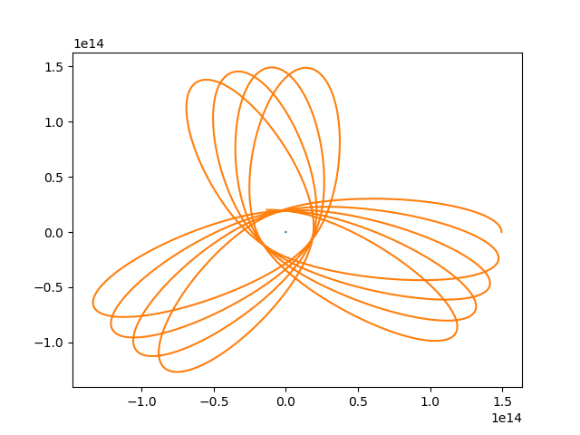
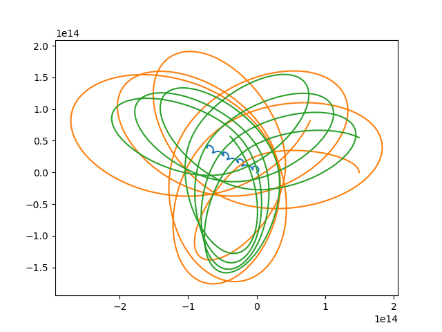
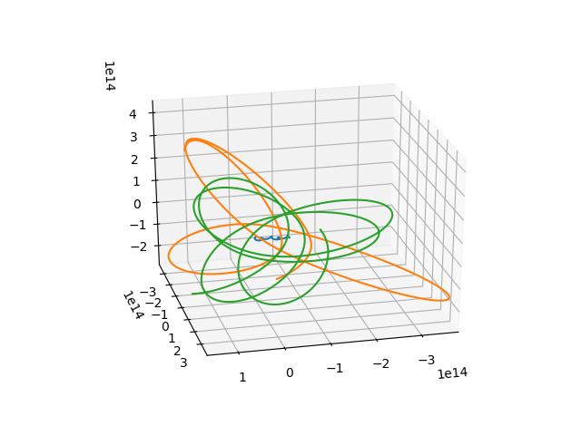
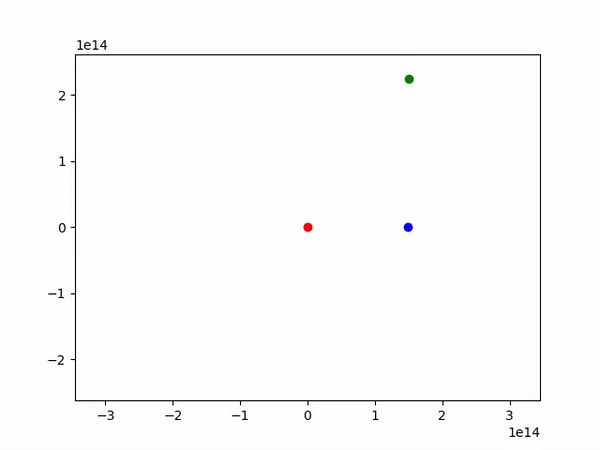

# nbody

This code simulates the n-body problem of classical mechanics. Utilizes two classes for the individual bodies and the overall system to maintain the state. Uses Euler's method to numerically compute the position updates. Visualized with both animated and stationary plots using matplotlib.

## Usage

Run `main.py` using your python installation. At the moment, the input values for the bodies need to be hardcoded in `main.py`. I may make this more user friendly in the future.

## Issues

* For animated figures, everything needs to be hardcoded at the moment. Hopefully will be fixed to not need this in the future.

* Can't choose which output, currently defaults to animated.

## Sample Output

